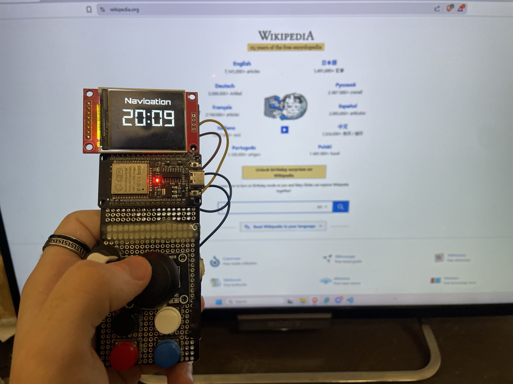
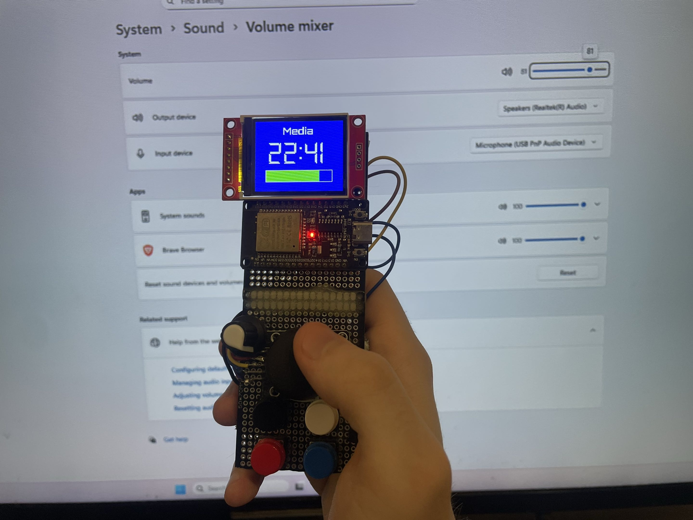
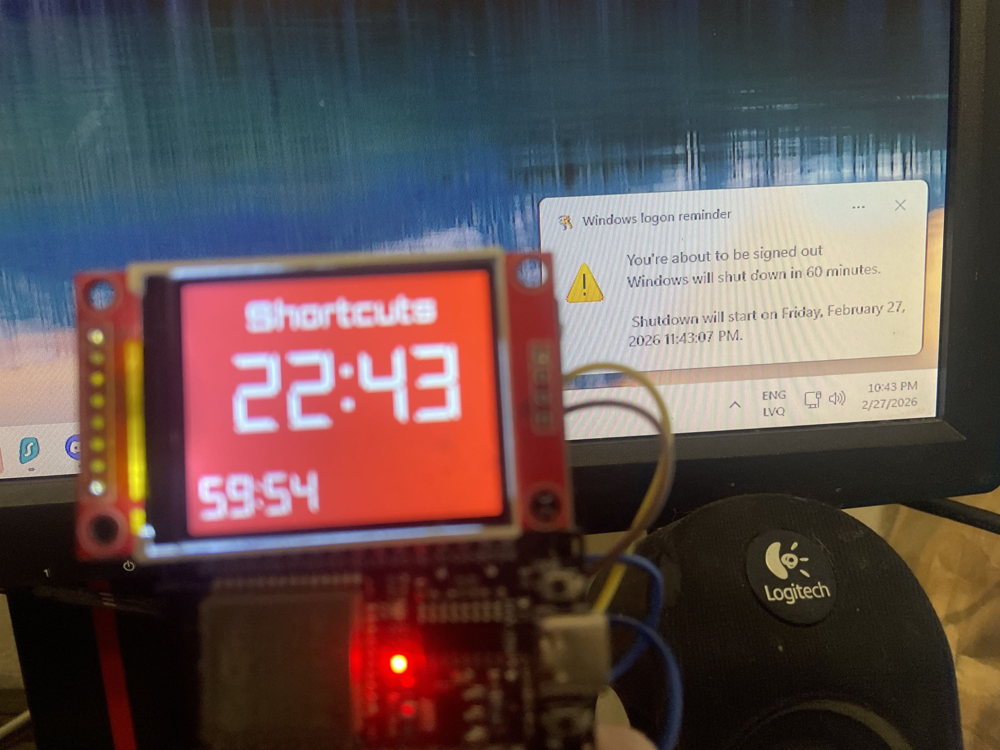
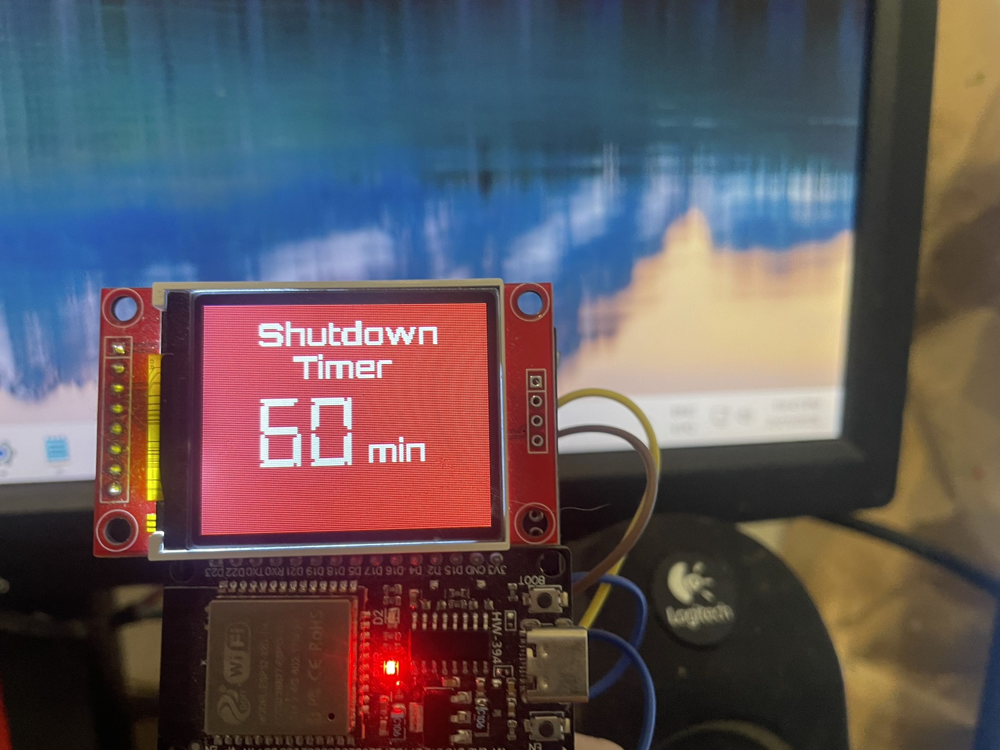

# ESP32 Air Mouse – Bluetooth PC Remote

A multi-mode Bluetooth PC controller using an ESP32, MPU6050, joystick, buttons, and OLED. Controls mouse, media, shortcuts, and provides real-time display feedback.

---

## Project Structure

```
ESP32 Air Mouse/
│
├─ firmware/
│  └─ sketch_apr9a/
│     └─ sketch_apr9a.ino   # Arduino sketch for ESP32
│
├─ fonts/
│  ├─ digital_715pt7b.h
│  └─ Orbitron_Bold9pt7b.h
│
├─ python/
│  └─ mousePynput.py       # Python script for PC integration
│
├─ tools/
│  └─ FreeVK.exe            # On-screen keyboard executable
│
├─ examples/
│  ├─ mode1_navigation.jpg
│  ├─ mode2_volume.jpg
│  ├─ mode3_shutdown_pc_side.jpg
│  ├─ mode3_shutdown_setting.jpg
│  └─ simple_usage.gif
│
├─ README.md
└─ LICENSE
```

> **Note:** Paths in the code reflect this structure. The Arduino sketch loads fonts from `fonts/`, and the Python script points to `tools/FreeVK.exe`. Update paths in the code if you move files elsewhere.

---

## Features

- Mouse control with accelerometer/gyro and joystick  
- Left/right click, scrolling, and precision movements  
- Media control (volume, track navigation, play/pause)  
- Shortcut keys and website/app launch  
- Shutdown timer with countdown  
- OLED feedback for mode, volume, timer, etc.  
- Real-time PC integration with Python (`pynput`, `pycaw`)  

---

## Dependencies

**Arduino:**

- MPU6050 library  
- Adafruit GFX  
- Adafruit ST7735  
- BLE Mouse library  

**Python (PC side):**

- pyserial  
- pynput  
- pycaw  
- psutil  
- pytz  
- comtypes  

> Install Python dependencies with:  
> `pip install pyserial pynput pycaw psutil pytz comtypes`

---

## Setup Instructions

1. **Arduino (ESP32)**  
   - Open `firmware/sketch_apr9a/sketch_apr9a.ino` in Arduino IDE.  
   - Ensure `fonts/` folder is in the root of the project (same level as `firmware/`).  
   - Install required Arduino libraries.  
   - Upload to ESP32.

2. **Python (PC integration)**  
   - Place `mousePynput.py` in `python/`.  
   - Ensure `FreeVK.exe` is in `tools/`.  
   - Update the path in `mousePynput.py` if necessary:  
     ```python
     keyboard_app_path = r"../tools/FreeVK.exe"
     ```  
   - Run with Python 3:  
     ```bash
     python mousePynput.py
     ```

---

## Usage & Modes – Full Tutorial

My ESP32 Air Mouse has **three main modes**, selectable via the potentiometer. Each mode changes joystick, SW button, and multifunction button behavior. The OLED provides feedback on mode, volume, and timer.  

---

### Mode 1 – Navigation (Mouse + Browser)  


Joystick Actions:
- Up → Scroll up
- Down → Scroll down
- Left → Zoom in (Ctrl + Shift + =)
- Right → Zoom out (Ctrl + -)

SW Button (joystick press):
- Single tap → Starts double-tap timer
- Double tap → Open new browser tab (Ctrl + T)
- 1-second hold → Close current browser tab (Ctrl + W)

Multifunction Button:
- Press → Toggle Free Virtual Keyboard (opens/closes FreeVK.exe)

**Testing Mode 1:**
1. Move joystick in all directions → scroll & zoom
2. Press SW button → single tap, double tap, long hold
3. Press multifunction button → open/close virtual keyboard
4. Observe OLED feedback

---

### Mode 2 – Media & Volume Control  


Joystick Actions:
- X axis (dominant)
  - Right → Volume up
  - Left → Volume down
- Y axis (dominant)
  - Up → Previous track
  - Down → Next track

SW Button:
- Short press (joystick at rest) → Play/Pause

**Testing Mode 2:**
1. Move joystick X → adjust volume
2. Move joystick Y → skip tracks
3. Press SW button → play/pause
4. Observe OLED feedback

---

### Mode 3 – Shutdown Timer & Shortcuts  



Multifunction Button:
- First press → Enter shutdown timer mode
- Second press → Exit shutdown timer mode

Joystick X axis:
- Right → Increase timer by 10 min
- Left → Decrease timer by 10 min

SW Button:
- Short press → Start shutdown timer
- Long press → Cancel shutdown timer

- Buttons → Open websites in Brave

**Testing Mode 3:**
1. Press multifunction button → enter timer mode
2. Move joystick X → increase/decrease timer
3. SW button short press → start shutdown timer (ensure safe testing)
4. SW button long press → cancel shutdown timer
5. Observe OLED feedback and system behavior

### Demo of Basic Usage


- You can see basic navigation in action

---

## Connections / Wiring

| Component | Pin on Component | Connected to ESP32 / Notes |
|-----------|----------------|---------------------------|
| **MPU6050** | VCC | 3.3V |
|            | GND | GND |
|            | SCL | D22 |
|            | SDA | D21 |
| **Display (ST7735)** | VCC | 5V |
|                     | GND | GND |
|                     | CS | D5 |
|                     | RESET | D17 |
|                     | A0 / DC | D16 |
|                     | SDA / MOSI | D23 |
|                     | SCK | D18 |
|                     | LED | 3.3V |
| **Bluetooth module** | VCC | 3.3V |
|                     | GND | GND |
|                     | RXD | D13 |
|                     | TXD | D4 |
| **Joystick** | GND | GND |
|              | +5V | 3.3V |
|              | VRx | D34 |
|              | VRy | D35 |
|              | SW | D32 |
| **Potentiometer** | Left pin | 3.3V |
|                  | Middle pin | D33 |
|                  | Right pin | GND |
| **Red Button** | Pin | D27 |
|                | Diagonal / GND | GND |
| **Blue Button** | Pin | D26 |
|                 | Diagonal / GND | GND |
| **Black Button** | Pin | D25 |
|                  | Diagonal / GND | GND |
| **White Button** | Pin | D14 |
|                  | Diagonal / GND | GND |
| **Arduino Nano (optional)** | 5V | 5V |
|                              | GND | GND |

---

## License

MIT License – see [LICENSE](./LICENSE)

---

## Notes

- Update COM port in `mousePynput.py` to match ESP32 connection  
- Ensure fonts and FreeVK.exe paths are correct  
- Tested on Windows 10/11 with ESP32 boards
